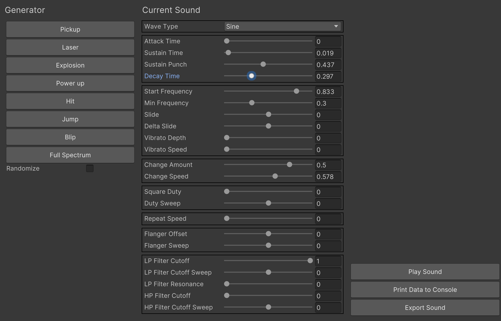
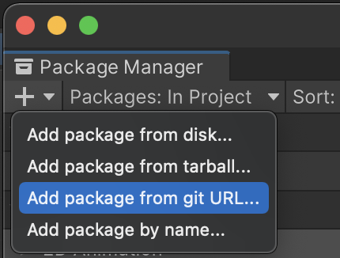
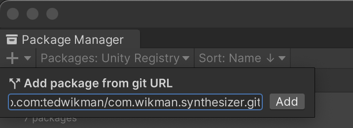

# Synthesizer

An audio synthesizer built on [Sfxr](https://www.drpetter.se/project_sfxr.html) / [Bfxr](https://www.bfxr.net/), packaged for Unity.

### In the package
The package comes with an editor window for edit time authoring, and runtime API for runtime generation of AudioClips.

#### Editor



The editor window can be found at __Window > Audio > Synthesizer__.

#### API
Generate a random AudioClip:
```c#
AudioClip clip = Wikman.Synthesizer.Synth.GenerateRandom();
```

Generate a random laser AudioClip:
```c#
AudioClip clip = Wikman.Synthesizer.Synth.GenerateRandom(EffectType.Laser);
```

Generate a jump AudioClip using a seed:
```c#
int seed = 12345;
AudioClip clip = Wikman.Synthesizer.Synth.GenerateRandom(EffectType.Jump, seed);
```

Generate a custom AudioClip:
```c#
var parameters = new Wikman.Synthesizer.EffectParameters()
{
    WaveType = 8,
    SustainTime = 0.3f,
    StartFrequency = 0.7f,
    Slide = -0.2f
};
AudioClip clip = Wikman.Synthesizer.Synth.Generate(parameters);
```

### How to get the package

Prerequisite: Unity 2021.3 or newer

Step 1: Open the Package Manager, press the + in the top left corner and select __Add package from git URL...__



Step 2: Add the following url to the field and press __Add__
```
git@github.com:tedwikman/com.wikman.synthesizer.git
```

